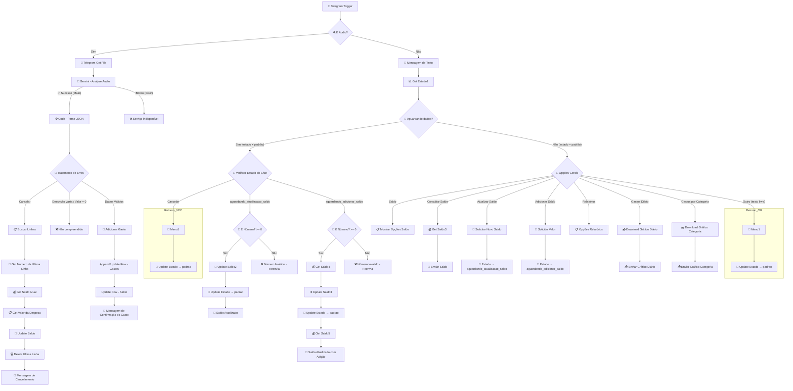

<h1 align="center"> AutoFin </h1>

  

Assistente pessoal de finanças via Telegram, construído com N8N. Registra despesas por mensagem de voz, gerencia saldo e gera relatórios visuais — tudo integrado ao Google Sheets.

---

## 😫 O Problema

Registrar gastos no dia a dia exige **digitar manualmente** cada detalhe (descrição, valor, data, categoria) em uma planilha ou aplicativo. No celular, isso é ainda mais cansativo e cheio de atritos:

- Abrir a planilha, encontrar a célula certa e preencher linha por linha
- Corrigir erros de digitação e formatação de valores
- Perder tempo que poderia ser gasto com o que realmente importa

**Consequência:** a maioria das pessoas desiste do controle financeiro em poucos dias, e os gastos voltam a passar despercebidos.

## 💡 A Solução

Um **bot no Telegram** que entende **áudio** e **texto**.  
Você fala algo como:

> “Gastei 25 reais no almoço hoje”

E ele faz todo o trabalho:

- 🎙️ **Transcreve** o áudio usando IA
- 🧠 **Interpreta** automaticamente: descrição, valor, categoria e data (inclusive expressões como “ontem”)
- 📊 **Lança a despesa** na planilha do Google Sheets
- 💰 **Atualiza o saldo** e envia uma confirmação

Tudo sem digitar uma única letra. Além de registrar gastos, o bot oferece comandos para consultar saldo, gerar gráficos e até cancelar o último lançamento – **totalmente por voz ou toque no menu**.

## ✨ Funcionalidades

* 🎤 Recebe áudios via Telegram
* 🧠 Transcreve e interpreta usando IA (Google Gemini)
* 💰 Extrai automaticamente:

  * Descrição
  * Categoria
  * Data
  * Valor
* 📊 Preenche os dados diretamente no Google Sheets
* ✅ Retorna confirmação no Telegram

---

## 🛠️ Tecnologias

| Ferramenta | Uso |
|---|---|
| [N8N](https://n8n.io) | Orquestração do fluxo de automação |
| [Telegram Bot API](https://core.telegram.org/bots/api) | Interface de comunicação com o usuário |
| [Google Gemini](https://deepmind.google/technologies/gemini/) | Transcrição e interpretação de áudios |
| [Google Sheets](https://sheets.google.com) | Armazenamento de gastos, saldo e estado do chat |

---

## 🗂️ Estrutura do Google Sheets

O projeto utiliza uma planilha com três abas principais:

### `Gastos`
Registra cada despesa com as colunas:

| Id | Descrição | Data | Valor | Dia | Categoria | Este mês |
|---|---|---|---|---|---|---|

### `Saldo`
Armazena o saldo atual do usuário (linha 2, coluna `Saldo atual`).

### `Estado do chat`
Controla o estado da conversa para fluxos de múltiplos passos:

| Estado | Descrição |
|---|---|
| `padrao` | Estado inicial / sem ação pendente |
| `aguardando_atualizacao_saldo` | Aguardando novo valor para substituir o saldo |
| `aguardando_adicionar_saldo` | Aguardando valor a somar ao saldo |

---

# 🏗️ Arquitetura Completa do Workflow n8n

## ⚙️ Configuração

### Pré-requisitos

- Instância do N8N (Sendo utilizado via domínio "HTTPS")
- Bot do Telegram criado via [@BotFather](https://t.me/BotFather)
- Conta Google com acesso ao Google Sheets
- Chave de API do Google Gemini 

### Passos

1. **Importe o fluxo** no N8N usando o arquivo JSON do projeto
2. **Configure as credenciais:**
   - `telegramApi` — token do seu bot
   - `googleSheetsOAuth2Api` — OAuth2 da conta Google
   - `googlePalmApi` — chave da API do Gemini
3. **Crie a planilha** no Google Sheets conforme planilha versionada.
4. **Ative o webhook** do Telegram Trigger no N8N
5. **Publique os gráficos** da planilha como imagem (Arquivo → Publicar na web → Gráfico → Imagem) e atualize as URLs nos nós `Download Grafico Diario1` e `Download Grafico Categoria1`

---

## 💬 Como Usar

| Ação | Como fazer |
|---|---|
| Registrar gasto | Envie um áudio: *"Gastei 45 reais no mercado hoje"* |
| Cancelar último gasto | Envie um áudio: *"Cancelar"* |
| Ver saldo | Toque em **Saldo → Consultar Saldo** |
| Atualizar saldo | Toque em **Saldo → Atualizar Saldo** e envie o valor |
| Adicionar ao saldo | Toque em **Saldo → Adicionar Saldo** e envie o valor |
| Ver relatório | Toque em **Relatórios → Gastos Diário** ou **Gastos por Categoria** |

### Categorias reconhecidas pelo bot
`Alimentação` · `Transporte` · `Saúde` · `Moradia` · `Lazer` · `Educação` · `Outros`

---

## 📋 Tratamento de Erros

| Situação | Comportamento |
|---|---|
| Áudio sem descrição | Mensagem pedindo para repetir com descrição e valor |
| Áudio sem valor | Mensagem pedindo para repetir com descrição e valor |
| Gemini indisponível | Mensagem informando que o serviço está fora do ar |
| Valor inválido no saldo | Mensagem solicitando número maior ou igual a 0 |

---

# 👨‍💻 Autores 👨‍💻

[Gabriel Mello](https://github.com/GabrielMello159)

[Enzo Rincon](https://github.com/Rincon23)

[Luis Torres](https://github.com/LuisTorresGit)

[Vinicius Tobias](https://github.com/vinitobias672003)

[Julia Moraes](https://github.com/julinhafmm)

[Ulisses Fernandes](https://github.com/Ulilos)

---
