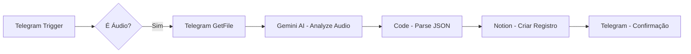

# 🤖 Automação de Controle Financeiro por Áudio (Telegram + n8n + Gemini + Notion)

Automação inteligente que permite registrar despesas financeiras **apenas enviando um áudio no Telegram**.
O sistema transcreve, interpreta e salva automaticamente os dados no Notion.

---

## ✨ Funcionalidades

* 🎤 Recebe áudios via Telegram
* 🧠 Transcreve e interpreta usando IA (Google Gemini)
* 💰 Extrai automaticamente:

  * Descrição
  * Categoria
  * Data
  * Valor
* 🗂️ Salva os dados diretamente no Notion
* ✅ Retorna confirmação no Telegram

---

## 🧩 Arquitetura do Fluxo



---

## 🚀 Tecnologias Utilizadas

* **n8n** → Orquestração da automação
* **Telegram Bot API** → Entrada de dados via áudio
* **Google Gemini (AI)** → Transcrição e interpretação
* **Notion API** → Armazenamento dos dados

---

## 📥 Entrada esperada

Envie um áudio no Telegram com algo como:

> "Gastei 45 reais no almoço hoje"

---

## 📤 Saída gerada

```json
{
  "descricao": "almoço no restaurante",
  "categoria": "Alimentação",
  "data": "2026-05-04",
  "valor": 45
}
```

---

## 🧠 Prompt da IA (Gemini)

A IA foi cuidadosamente instruída para:

* Transcrever o áudio
* Interpretar contexto (ex: "hoje", "ontem")
* Classificar automaticamente a categoria
* Retornar **apenas JSON válido**

### Categorias suportadas:

* Alimentação
* Transporte
* Saúde
* Moradia
* Lazer
* Educação
* Outros

---

## ⚙️ Configuração

### 1. Telegram

* Crie um bot via **@BotFather**
* Copie o token
* Configure no node `Telegram Trigger`

---

### 2. Google Gemini

* Gere uma API Key no Google AI Studio
* Configure no node `Google Gemini`

---

### 3. Notion

Crie um database com os campos:

| Campo     | Tipo   |
| --------- | ------ |
| Descrição | Title  |
| Categoria | Select |
| Valor     | Number |
| Data      | Date   |

* Conecte sua integração
* Copie o `database_id`

---

### 4. n8n

* Importe o JSON do workflow
* Configure as credenciais:

  * Telegram
  * Gemini
  * Notion

---

## 🧪 Lógica do Código (Parsing)

O node de código:

* Remove markdown (` ```json `)
* Faz parse seguro do JSON
* Garante fallback:

```javascript
descricao: ''
categoria: 'Outros'
data: hoje
valor: 0
```

---

## ⚠️ Possíveis Problemas

### ❌ Áudio não reconhecido

* Verifique se é `audio/ogg`

### ❌ Erro de JSON

* O modelo pode retornar texto inválido
* Já tratado com sanitização no código

### ❌ Valor não identificado

* Retorna automaticamente `0`

---

## 🔥 Melhorias Futuras

* 📊 Dashboard automático (Supabase / Metabase)
* 📈 Gráficos de gastos
* 💳 Detecção de meio de pagamento
* 🧾 OCR de recibos/imagens
* 🗣️ Suporte a WhatsApp
* 🔔 Alertas de gastos excessivos

---

## 📸 Exemplo de Uso

1. Usuário envia áudio 🎤
2. IA entende:

   > "Uber pro trabalho deu 23 reais ontem"
3. Sistema salva automaticamente no Notion
4. Retorno:

```
Despesa registrada com sucesso! ✅
```

---

## 🧑‍💻 Autor

Desenvolvido por Gabriel Mello🚀

---

## ⭐ Contribuição


---
